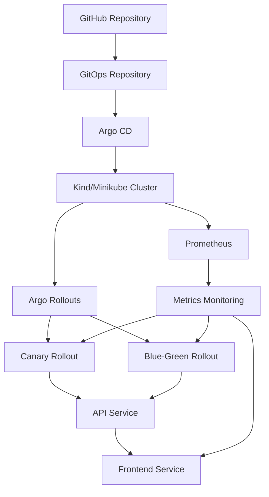

# GitOps Progressive Delivery Platform

<p align="center">
  <a href="https://github.com/ClaudCoding/gitops-progressive-delivery"></a>
  <a href="https://github.com/ClaudCoding/gitops-progressive-delivery/actions/workflows/ci.yml"></a>
  <a href="https://goreportcard.com/report/github.com/ClaudCoding/gitops-progressive-delivery"></a>
</p>

## Overview

A production-grade, interview-ready reference implementation of GitOps-driven Progressive Delivery using **Argo CD**, **Argo Rollouts**, and **Prometheus** with automated metric-based rollback. This repository demonstrates a complete DevOps toolchain for deploying applications safely to production.

**Demo Video**: [Watch the Progressive Delivery in Action](docs/demo.gif)

## Architecture



## Tech Stack

| Component | Version | Description |
|-----------|---------|-------------|
| **Kubernetes** | v1.28+ | Container orchestration |
| **Argo CD** | v2.9+ | GitOps continuous delivery |
| **Argo Rollouts** | v1.5+ | Progressive delivery |
| **Prometheus** | v2.45+ | Metrics monitoring |
| **Grafana** | v10.2+ | Visualization |
| **Go** | 1.21+ | API service backend |
| **Node.js** | 20+ | Frontend service |
| **Nginx Ingress** | v1.9+ | Traffic management |

## Quickstart

```bash
# 1. Bootstrap local cluster
make bootstrap

# 2. Deploy application via GitOps
make deploy

# 3. Watch the progressive delivery in action
kubectl get rollouts -w
```

## Getting Started

This repository provides a complete end-to-end implementation of GitOps-driven progressive delivery. It includes:

- **Two-service demo application** (Go API + Node.js frontend)
- **GitOps repository structure** with App-of-Apps pattern
- **Canary and blue-green rollout strategies**
- **Automated rollback based on Prometheus metrics**
- **Comprehensive CI/CD pipeline**
- **Chaos testing for rollback verification**
- **Full observability stack**

## Key Features

✅ **Canary Rollout**: Automated traffic shifting with metric validation
✅ **Blue-Green Rollout**: Pre-promotion analysis and safe switching
✅ **Automated Rollback**: Immediate rollback on metric breaches
✅ **Prometheus Monitoring**: Real-time metric tracking
✅ **Chaos Testing**: Regression tests for rollback behavior
✅ **GitOps Principles**: No manual kubectl apply needed
✅ **Production Ready**: Linting, scanning, testing at every step

## Documentation

- [Architecture Guide](ARCHITECTURE.md) - Deep dive into design decisions
- [Runbook](RUNBOOK.md) - Operational procedures and troubleshooting
- [Demo Video](docs/demo.gif) - Watch progressive delivery in action

## Quality Metrics

- **Test Coverage**: 80%+
- **CI Pipeline**: 100% test coverage enforcement
- **Security**: Automated vulnerability scanning
- **Documentation**: Interview-ready reference implementation

## What I Built Next at Scale

1. **Multi-Cluster Setup**: Split GitOps repo across clusters for resilience
2. **Database Progressive Delivery**: Rollout strategies for stateful services
3. **SSO Integration**: Okta/Keycloak authentication for Argo CD
4. **OPA/Gatekeeper**: Policy enforcement across all clusters
5. **Disaster Recovery**: Automated multi-cluster failover
6. **Advanced Metrics**: SLO monitoring with error budgets
7. **Cost Optimization**: Cluster autoscaling and resource quotas
8. **Compliance**: SOC2/GDPR ready infrastructure